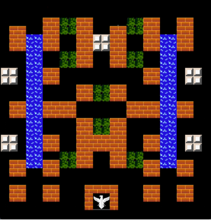
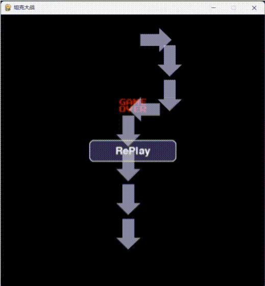
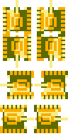

# AI Tank War

AI Tank War 是一个基于 Pygame 开发的坦克对战游戏，融合了经典坦克大战的游戏玩法和现代 AI 对战元素。


## 游戏特色

### 游戏AI特性
#### AI生成地图
将地图中的不同环境方块进行数字编码，使 AI 仅需生成数字矩阵，即可表示多样化的地图布局。

 
#### 敌方AI行动
AI 根据地图和玩家位置信息，生成敌方坦克行动路径点。底层调用寻路算法控制坦克行动。

 

### 丰富的游戏元素

| 玩家坦克 | 敌方坦克 | 基地 |
|:---:|:---:|:---:|
|  |  |  |

### 多样化地形

| 砖块 | 铁块 | 树林 | 河流 |
|:---:|:---:|:---:|:---:|
|  |  |  |  |

### 战斗系统

- 四向射击系统
  | 上 | 下 | 左 | 右 |
  |:---:|:---:|:---:|:---:|
  |  |  |  |  |

## 游戏模式

### 无尽模式
- 在持续生成的 AI 坦克中生存
- 击败敌方坦克获得分数
- 游戏难度随时间递增

### 单关模式
- 分级关卡设计
- 每关具有特定的地图布局和敌人配置
- 完成目标后解锁下一关

## 系统要求

- Python 3.8+
- Pygame 2.5.0+
- 其他依赖见 requirements.txt

## 安装说明

1. 克隆项目到本地：
```bash
git clone [repository-url]
```

2. 安装依赖：
```bash
pip install -r requirements.txt
```

## 运行游戏

在项目根目录下运行：
```bash
python src/main.py
```

## 游戏控制

- 玩家坦克控制：
  - ↑：向上移动
  - ↓：向下移动
  - ←：向左移动
  - →：向右移动
  - 空格键：发射子弹
- 菜单操作：
  - 鼠标点击：选择选项
  - ESC：返回上一级菜单

## 项目结构

```
AITankWar/
├── src/                    # 源代码目录
│   ├── main.py            # 游戏入口
│   ├── config/            # 配置文件
│   ├── mode/              # 游戏模式
│   ├── entry/             # 游戏实体
│   ├── control/           # 控制器
│   └── attribute/         # 属性系统
├── data/                  # 游戏资源
│   ├── image/            # 图片资源
│   └── maps/             # 地图数据
├── requirements.txt       # 项目依赖
└── README.md             # 项目说明
```

## 技术特点

- 基于 Pygame 引擎开发
- 使用 A* 算法实现 AI 寻路
- 采用面向对象设计实现游戏实体
- 支持自定义地图和关卡设计
- 完整的碰撞检测系统
- 智能的敌方 AI 行为决策

## 注意事项

- 确保系统安装了支持中文显示的字体
- 游戏窗口分辨率为 800x600
- 需要足够的系统内存运行 AI 算法

## 贡献指南

欢迎提交 Issue 和 Pull Request 来帮助改进游戏。在提交代码前，请确保：

1. 代码符合项目的编码规范
2. 新功能有足够的测试覆盖
3. 更新相关文档

## 游戏截图


## 联系方式

- 项目主页：[GitHub 仓库地址]